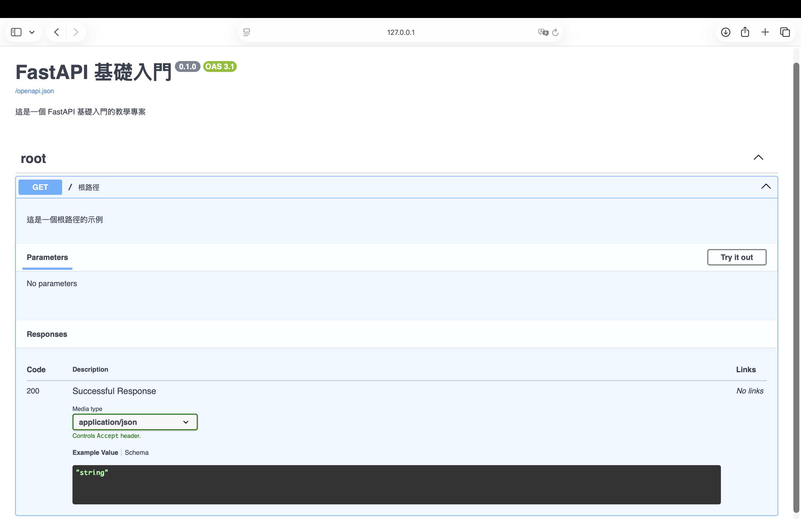

# 01 - FastAPI 基礎入門

## 目錄
- [環境設定](#環境設定)
- [建立第一個 FastAPI 應用](#建立第一個-fastapi-應用)
- [OpenAPI 文檔配置](#openapi-文檔配置)
- [啟動應用](#啟動應用)
- [探索自動生成的 API 文檔](#探索自動生成的-api-文檔)
- [Flask vs FastAPI 基本語法對比](#flask-vs-fastapi-基本語法對比)

## 環境設定

### 前置需求
- Python 3.9 或以上版本
- [uv](https://github.com/astral-sh/uv) - 快速的 Python 套件管理工具

### 步驟 1：初始化專案

使用 `uv` 快速建立新專案：

```bash
# 建立並進入專案目錄
mkdir fastapi-demo
cd fastapi-demo

# 初始化專案（會自動建立虛擬環境和 pyproject.toml）
uv init
```

這會建立以下結構：
```
fastapi-demo/
├── .python-version
├── pyproject.toml
├── README.md
└── hello.py
```

### 步驟 2：安裝依賴

使用 `uv add` 安裝 FastAPI 及相關套件：

```bash
# 安裝 FastAPI 和 Uvicorn（ASGI 伺服器）
uv add fastapi uvicorn[standard]
```

**套件說明：**
- `fastapi`: FastAPI 框架本身
- `uvicorn[standard]`: ASGI 伺服器，用於運行 FastAPI 應用
  - `[standard]` 包含額外的生產環境依賴（如 websockets、watchfiles）

安裝完成後，`pyproject.toml` 會自動更新：

```toml
[project]
dependencies = [
    "fastapi>=0.104.0",
    "uvicorn[standard]>=0.24.0",
]
```

## 建立第一個 FastAPI 應用

### 步驟 3：建立 main.py

在專案根目錄建立 `main.py`：

```python
import uvicorn
from fastapi import FastAPI

app = FastAPI(
    title="FastAPI 基礎入門",
    description="這是一個 FastAPI 基礎入門的教學專案",
    version="0.1.0",
    docs_url="/docs",
    redoc_url="/redoc",
)

@app.get("/", tags=["root"], summary="根路徑", description="這是一個根路徑的示例")
def read_root():
    return {"message": "Hello, FastAPI!"}

if __name__ == "__main__":
    uvicorn.run(app, host="0.0.0.0", port=8000)
```

### 程式碼解析

#### 1. 匯入模組
```python
import uvicorn
from fastapi import FastAPI
```
- `FastAPI`: 核心應用類別
- `uvicorn`: ASGI 伺服器，用於執行應用

#### 2. 建立應用實例
```python
app = FastAPI()
```
這就建立了一個 FastAPI 應用，非常簡單！

#### 3. 定義路由
```python
@app.get("/")
def read_root():
    return {"message": "Hello, FastAPI!"}
```
- `@app.get("/")`: 裝飾器，定義 GET 方法的路由
- FastAPI 會自動將 Python 字典轉換為 JSON 回應

## OpenAPI 文檔配置

FastAPI 最強大的功能之一就是**自動生成 API 文檔**。透過配置 `FastAPI` 實例，你可以自訂文檔的各種資訊。

### 應用層級的配置

```python
app = FastAPI(
    title="FastAPI 基礎入門",           # API 標題
    description="這是一個 FastAPI 基礎入門的教學專案",  # API 描述
    version="0.1.0",                    # API 版本
    docs_url="/docs",                   # Swagger UI 路徑
    redoc_url="/redoc",                 # ReDoc 路徑
    openapi_url="/openapi.json",        # OpenAPI schema JSON 路徑（預設）
)
```

#### 參數說明

| 參數 | 說明 | 預設值 | 範例 |
|------|------|--------|------|
| `title` | API 的標題 | `"FastAPI"` | `"我的 API"` |
| `description` | API 的詳細描述，支援 Markdown | `""` | `"這是一個**強大的** API"` |
| `version` | API 版本號 | `"0.1.0"` | `"1.0.0"` |
| `docs_url` | Swagger UI 的路徑 | `"/docs"` | `"/api/docs"` 或 `None` 關閉 |
| `redoc_url` | ReDoc 的路徑 | `"/redoc"` | `"/api/redoc"` 或 `None` 關閉 |
| `openapi_url` | OpenAPI schema 的路徑 | `"/openapi.json"` | `"/api/openapi.json"` |
| `openapi_tags` | 標籤的分組與描述 | `None` | 見下方範例 |

### 路由層級的配置

```python
@app.get(
    "/",                                    # 路徑
    tags=["root"],                          # 標籤，用於分組
    summary="根路徑",                       # 簡短摘要
    description="這是一個根路徑的示例",     # 詳細描述
    response_description="成功回應"         # 回應說明
)
def read_root():
    """
    # 根路徑端點
    
    這裡可以寫更詳細的文檔，支援 **Markdown** 格式。
    
    - 項目 1
    - 項目 2
    """
    return {"message": "Hello, FastAPI!"}
```

#### 裝飾器參數說明

| 參數 | 說明 | 顯示位置 |
|------|------|---------|
| `tags` | API 分組標籤（列表） | Swagger UI 的側邊欄分組 |
| `summary` | 簡短摘要（一行） | API 列表中的標題 |
| `description` | 詳細描述 | 展開後的詳細說明 |
| `response_description` | 回應說明 | Responses 區塊 |
| 函數的 docstring | 最詳細的說明 | 會覆蓋 `description` |

### 進階：自訂標籤分組

```python
tags_metadata = [
    {
        "name": "users",
        "description": "使用者相關操作",
    },
    {
        "name": "items",
        "description": "項目管理功能",
        "externalDocs": {
            "description": "外部文檔",
            "url": "https://example.com",
        },
    },
]

app = FastAPI(
    openapi_tags=tags_metadata
)

@app.get("/users/", tags=["users"])
def read_users():
    return [{"username": "johndoe"}]

@app.get("/items/", tags=["items"])
def read_items():
    return [{"name": "Item"}]
```

## 啟動應用

### 方法 1：使用 Python 直接執行

```bash
uv run python main.py
```

或者如果已經啟用虛擬環境：

```bash
python main.py
```

### 方法 2：使用 Uvicorn 指令（推薦開發時使用）

```bash
# 基本啟動
uv run uvicorn main:app

# 啟用熱重載（程式碼修改自動重啟）
uv run uvicorn main:app --reload

# 自訂 host 和 port
uv run uvicorn main:app --reload --host 0.0.0.0 --port 8000

# 顯示更多日誌
uv run uvicorn main:app --reload --log-level debug
```

#### 參數說明
- `main:app`: `main` 是檔案名稱，`app` 是 FastAPI 實例的變數名稱
- `--reload`: 開發模式，檔案變更時自動重載（⚠️ 生產環境不要使用）
- `--host 0.0.0.0`: 允許外部訪問
- `--port 8000`: 指定埠號

### 啟動成功訊息

```
INFO:     Uvicorn running on http://0.0.0.0:8000 (Press CTRL+C to quit)
INFO:     Started reloader process [28720]
INFO:     Started server process [28722]
INFO:     Waiting for application startup.
INFO:     Application startup complete.
```

## 探索自動生成的 API 文檔

> 🎯 **FastAPI 的核心優勢：寫完程式碼，文檔自動生成！**
> 
> 不需要額外撰寫文檔，不需要手動維護 API 規格，只要寫好你的 Python 程式碼，FastAPI 會自動生成完整、互動式、符合標準的 API 文檔。

### 📊 FastAPI vs Flask 文檔對比

| 項目 | Flask | FastAPI |
|------|-------|---------|
| **基本文檔** | ❌ 無內建支援 | ✅ 自動生成 |
| **互動式測試** | ❌ 需安裝 Flask-RESTX 或 Flasgger | ✅ 開箱即用 |
| **Swagger UI** | ⚠️ 需手動整合 | ✅ 自動生成（`/docs`） |
| **ReDoc** | ⚠️ 需手動整合 | ✅ 自動生成（`/redoc`） |
| **OpenAPI 規格** | ⚠️ 需使用第三方工具 | ✅ 自動生成（`/openapi.json`） |
| **文檔維護成本** | 🔴 高（需手動同步） | 🟢 零（自動同步） |
| **程式碼改動** | 🔴 需額外註解/裝飾器 | 🟢 原本就需要的型別提示 |

**Flask 需要額外做的事：**
```python
# Flask 需要安裝並配置額外套件
pip install flask-restx
# 或
pip install flasgger

# 需要額外的註解和配置
@api.doc('get_users')
@api.marshal_list_with(user_model)
def get_users():
    """獲取使用者列表"""
    pass
```

**FastAPI 只需要正常寫程式碼：**
```python
# FastAPI 不需要額外套件，正常寫程式碼即可
@app.get("/users")
def get_users():
    """獲取使用者列表"""
    return [{"id": 1, "name": "John"}]
# 文檔自動生成！✨
```

---

FastAPI 會自動生成三種文檔介面：

### 1. Swagger UI (互動式文檔)

**網址：** http://localhost:8000/docs

**特色：**
- ✅ 互動式介面，可直接在瀏覽器測試 API
- ✅ 顯示所有端點、參數、回應格式
- ✅ 支援「Try it out」直接發送請求
- ✅ 自動顯示請求/回應範例
- ✅ 完全符合 OpenAPI 3.0+ 標準



**使用步驟：**
1. 打開 http://localhost:8000/docs
2. 點擊任一 API 端點展開
3. 點擊「Try it out」按鈕
4. 填寫參數（如果需要）
5. 點擊「Execute」執行
6. 查看回應結果

### 2. ReDoc (美觀的文檔)

**網址：** http://localhost:8000/redoc

**特色：**
- ✅ 更美觀、更適合閱讀的文檔介面
- ✅ 三欄式佈局，專業美觀
- ✅ 適合對外展示或生成 PDF
- ✅ 響應式設計，支援行動裝置
- ❌ 無法直接測試 API（僅供閱讀）

**實際範例：**


從上圖可以看到，我們只寫了簡單的程式碼，ReDoc 就自動生成了：
- 📋 API 標題和描述
- 🏷️ 標籤分組（root）
- 📝 端點的摘要和詳細說明
- 📊 完整的回應範例

**完全不需要手動撰寫任何文檔！**

---

### 💡 關鍵優勢總結

**寫完程式碼 = 完成文檔**

1. **零額外成本**：不需要學習額外的文檔工具
2. **永不過期**：文檔與程式碼自動同步
3. **標準規範**：完全符合 OpenAPI 3.0+ 規格
4. **多種介面**：Swagger UI（測試）+ ReDoc（閱讀）+ JSON（整合）
5. **團隊協作**：前端可以直接看文檔開發，後端修改即時反映

相比 Flask 需要：
- ❌ 安裝 Flask-RESTX 或 Flasgger
- ❌ 學習額外的 API 規格語法
- ❌ 手動維護文檔與程式碼的同步
- ❌ 擔心文檔過期問題

**FastAPI 讓你專注於寫程式碼，文檔自然而然就有了！** 🚀

## Flask vs FastAPI 基本語法對比

### 最基本的應用

#### Flask
```python
from flask import Flask

app = Flask(__name__)

@app.route('/')
def hello():
    return {'message': 'Hello World'}

if __name__ == '__main__':
    app.run(debug=True)
```

#### FastAPI
```python
from fastapi import FastAPI

app = FastAPI()

@app.get('/')
def hello():
    return {'message': 'Hello World'}

if __name__ == '__main__':
    import uvicorn
    uvicorn.run(app, host="0.0.0.0", port=8000)
```

### 關鍵差異

| 特性 | Flask | FastAPI |
|------|-------|---------|
| **路由裝飾器** | `@app.route('/')` | `@app.get('/')` |
| **HTTP 方法** | `@app.route('/', methods=['GET', 'POST'])` | `@app.get('/')`, `@app.post('/')` |
| **自動 JSON** | 需要 `jsonify()` 或返回 dict | 自動轉換 |
| **執行伺服器** | `app.run()` | `uvicorn.run(app)` |
| **API 文檔** | ❌ 需安裝額外套件 | ✅ 自動生成 |
| **型別提示** | 可選 | 強烈建議（用於驗證） |

### 多個路由範例

#### Flask
```python
@app.route('/')
def index():
    return {'message': 'Index'}

@app.route('/items', methods=['GET'])
def get_items():
    return {'items': []}

@app.route('/items', methods=['POST'])
def create_item():
    return {'status': 'created'}
```

#### FastAPI
```python
@app.get('/')
def index():
    return {'message': 'Index'}

@app.get('/items')
def get_items():
    return {'items': []}

@app.post('/items')
def create_item():
    return {'status': 'created'}
```

**FastAPI 優勢：**
- ✅ 裝飾器明確指定 HTTP 方法，更清晰
- ✅ 避免在同一路由混合多個方法
- ✅ 自動生成的文檔會正確分組不同的 HTTP 方法

## 驗證你的第一個 API

### 測試端點

#### 使用 curl
```bash
curl http://localhost:8000/
```

#### 使用 httpie
```bash
http http://localhost:8000/
```

#### 使用 Python requests
```python
import requests

response = requests.get('http://localhost:8000/')
print(response.json())
# {'message': 'Hello, FastAPI!'}
```

### 預期輸出
```json
{
  "message": "Hello, FastAPI!"
}
```

## 常見問題

### Q1: `uv: command not found`
**解決方案：** 需要先安裝 uv
```bash
# macOS/Linux
curl -LsSf https://astral.sh/uv/install.sh | sh

# Windows
powershell -c "irm https://astral.sh/uv/install.ps1 | iex"

# 使用 pip
pip install uv
```

### Q2: 為什麼要用 `uvicorn[standard]` 而不是 `uvicorn`？
- `uvicorn[standard]` 包含：
  - `websockets`: WebSocket 支援
  - `httptools`: 更快的 HTTP 解析
  - `uvloop`: 更高效的事件迴圈（Linux/macOS）
  - `watchfiles`: 熱重載功能

### Q3: 可以關閉自動生成的文檔嗎？
可以！在生產環境中可能會想關閉：
```python
app = FastAPI(docs_url=None, redoc_url=None)
```

### Q4: FastAPI 可以像 Flask 一樣渲染 HTML 模板嗎？
可以，但需要額外配置：
```bash
uv add jinja2
```
```python
from fastapi.templating import Jinja2Templates

templates = Jinja2Templates(directory="templates")

@app.get("/")
def read_root(request: Request):
    return templates.TemplateResponse("index.html", {"request": request})
```


## 參考資源

- [FastAPI 官方文檔](https://fastapi.tiangolo.com/)
- [Uvicorn 文檔](https://www.uvicorn.org/)
- [uv 文檔](https://github.com/astral-sh/uv)
- [OpenAPI 規範](https://swagger.io/specification/)

