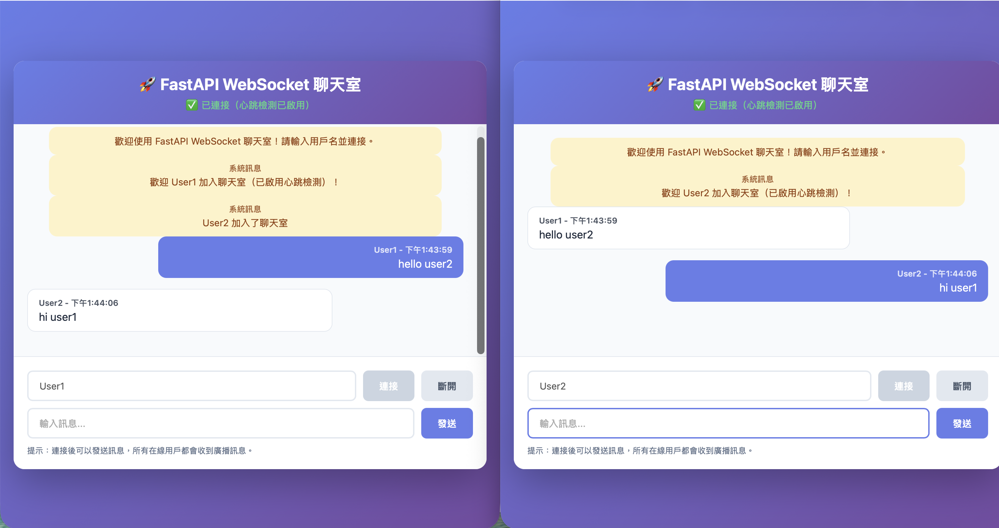

# 08 - WebSocket 與實時通訊

## 本章學習重點

本章重點學習 **WebSocket 實時通訊**，從 Flask-SocketIO 遷移到 FastAPI 原生的 WebSocket 支援。我們將實戰演練如何建立實時聊天室、管理連接、廣播訊息，並與前端整合。

✅ **已包含的內容：**
- Flask-SocketIO → FastAPI WebSocket 遷移對比
- WebSocket 基礎概念與語法
- 連接管理（ConnectionManager）
- 訊息廣播與點對點通訊（**包括發送者自己**）⭐
- **心跳檢測 (Heartbeat)** - 必須自己實現 ⭐
- 前端 HTML 整合範例（**自己的消息顯示在右側**）⭐

## 目錄

- [專案結構](#專案結構)
- [Flask-SocketIO vs FastAPI WebSocket](#flask-socketio-vs-fastapi-websocket)
- [WebSocket 基礎概念](#websocket-基礎概念)
- [連接管理](#連接管理)
- [訊息廣播](#訊息廣播)
- [心跳檢測 (Heartbeat)](#心跳檢測-heartbeat) ⭐
- [使用方式](#使用方式)
- [最終呈現效果](#最終呈現效果) ⭐
- [前端整合](#前端整合)
- [常見問題](#常見問題)

## 專案結構

```
08-realtime-websocket/
├── main.py                    # 應用程式入口
├── pyproject.toml             # 專案依賴配置
├── routers/                   # 路由層
│   ├── __init__.py
│   └── websocket.py           # WebSocket 路由處理器 ⭐
├── static/                    # 靜態文件
│   └── chat.html              # 前端聊天室頁面 ⭐
├── assets/                    # 資源文件
│   └── chat.png               # 聊天室效果截圖
└── README.md
```

## Flask-SocketIO vs FastAPI WebSocket

### Flask-SocketIO 方式

```python
# Flask-SocketIO
from flask_socketio import SocketIO, emit, join_room, leave_room

app = Flask(__name__)
socketio = SocketIO(app, cors_allowed_origins="*")

@socketio.on('connect')
def handle_connect():
    emit('response', {'data': 'Connected'})

@socketio.on('message')
def handle_message(data):
    emit('response', {'data': data}, broadcast=True)
```

### FastAPI WebSocket 方式

```python
# FastAPI WebSocket
from fastapi import WebSocket

@app.websocket("/ws")
async def websocket_endpoint(websocket: WebSocket):
    await websocket.accept()
    try:
        while True:
            data = await websocket.receive_text()
            # 處理訊息
            await websocket.send_text(f"Echo: {data}")
    except WebSocketDisconnect:
        pass
```

### 主要差異對比

| 特性 | Flask-SocketIO | FastAPI WebSocket |
|------|---------------|-------------------|
| **依賴** | 需要 `flask-socketio` | **內建支援**，無需額外依賴 |
| **事件系統** | 基於事件（`@socketio.on()`） | 基於協程（`async def`） |
| **房間管理** | 內建 `join_room()` / `leave_room()` | 需要手動實現 |
| **廣播** | `emit(..., broadcast=True)` | 需要手動遍歷連接 |
| **異步支援** | 需要額外配置 | **原生異步支援** |
| **性能** | 基於 gevent/eventlet | 基於 ASGI（更高效） |

## WebSocket 基礎概念

### 什麼是 WebSocket？

WebSocket 是一種**全雙工通訊協議**，允許客戶端和服務器之間建立持久連接，實現**實時雙向通訊**。

**與 HTTP 的區別：**
- **HTTP**：請求-回應模式，每次請求都需要建立新連接
- **WebSocket**：持久連接，雙方都可以主動發送訊息

### WebSocket 生命週期

```
1. 客戶端發起連接請求
   ↓
2. 服務器接受連接（handshake）
   ↓
3. 建立持久連接
   ↓
4. 雙向通訊（發送/接收訊息）
   ↓
5. 連接關閉（客戶端或服務器主動關閉）
```

### FastAPI WebSocket 基本語法

#### 1. 定義 WebSocket 端點

```python
from fastapi import WebSocket, WebSocketDisconnect

@app.websocket("/ws")
async def websocket_endpoint(websocket: WebSocket):
    # 接受連接
    await websocket.accept()
    
    try:
        while True:
            # 接收訊息
            data = await websocket.receive_text()
            # 發送訊息
            await websocket.send_text(f"Echo: {data}")
    except WebSocketDisconnect:
        # 處理斷線
        print("Client disconnected")
```

#### 2. 接收訊息的方式

```python
# 接收文字訊息
text = await websocket.receive_text()

# 接收 JSON 訊息
json_data = await websocket.receive_json()

# 接收二進制訊息
bytes_data = await websocket.receive_bytes()
```

#### 3. 發送訊息的方式

```python
# 發送文字訊息
await websocket.send_text("Hello")

# 發送 JSON 訊息
await websocket.send_json({"message": "Hello"})

# 發送二進制訊息
await websocket.send_bytes(b"Hello")
```

## 連接管理

### ConnectionManager 類別

為了管理多個 WebSocket 連接，我們創建了一個 `ConnectionManager` 類別：

```python
class ConnectionManager:
    def __init__(self):
        # 儲存所有活躍連接
        self.active_connections: Set[WebSocket] = set()
        # 儲存用戶名與連接的對應關係
        self.user_connections: Dict[str, WebSocket] = {}
    
    async def connect(self, websocket: WebSocket, username: str = None):
        """接受新連接"""
        await websocket.accept()
        self.active_connections.add(websocket)
        if username:
            self.user_connections[username] = websocket
    
    def disconnect(self, websocket: WebSocket, username: str = None):
        """移除連接"""
        self.active_connections.discard(websocket)
        if username:
            del self.user_connections[username]
```

### 連接管理功能

1. **連接追蹤**：使用 `Set[WebSocket]` 儲存所有活躍連接
2. **用戶識別**：使用 `Dict[str, WebSocket]` 儲存用戶名與連接的對應
3. **自動清理**：當連接斷開時自動移除

## 訊息廣播

### 廣播給所有連接（包括發送者自己）

本專案實現的廣播機制會**將訊息發送給所有連接的用戶，包括發送者自己**。這樣可以確保：
- ✅ 發送者也能看到自己發送的消息（類似微信/iMessage 的體驗）
- ✅ 前端可以根據用戶名判斷是否為自己的消息，並顯示在右側

```python
async def broadcast(self, message: str, exclude: WebSocket = None):
    """廣播訊息給所有連接的客戶端（包括發送者自己）"""
    for connection in self.active_connections:
        if connection != exclude:  # exclude=None 時，所有人都能收到
            await connection.send_text(message)
```

**使用方式：**
```python
# 廣播給所有人（包括發送者自己）
await manager.broadcast(
    json.dumps(broadcast_data),
    exclude=None  # 不排除任何人，所有人都能收到
)

# 系統訊息通常排除發送者（如加入/離開通知）
await manager.broadcast(
    json.dumps(join_message),
    exclude=websocket  # 排除發送者
)
```

### 點對點通訊

```python
async def send_to_user(self, message: str, username: str):
    """發送訊息給特定用戶"""
    if username in self.user_connections:
        await self.user_connections[username].send_text(message)
```

### 訊息格式

我們使用 JSON 格式來傳遞結構化訊息：

```python
# 系統訊息
{
    "type": "system",
    "message": "歡迎加入聊天室！",
    "connected_count": 5
}

# 聊天訊息
{
    "type": "message",
    "username": "Alice",
    "message": "Hello, everyone!",
    "timestamp": "2024-01-01T12:00:00Z"
}

# 私訊
{
    "type": "private",
    "from": "Alice",
    "message": "Secret message",
    "timestamp": "2024-01-01T12:00:00Z"
}
```

## 使用方式

### 1. 安裝依賴

```bash
cd 08-realtime-websocket
uv sync
```

### 2. 啟動服務器

```bash
# 方式 1：使用 uvicorn 命令
uvicorn main:app --reload --host 0.0.0.0 --port 8000

# 方式 2：直接運行 main.py
python main.py
```

### 3. 訪問前端頁面

打開瀏覽器訪問：
- **聊天室頁面**：http://localhost:8000/chat
- **API 文檔**：http://localhost:8000/docs

### 最終呈現效果

以下是聊天室的實際運行效果，展示了兩個用戶（User1 和 User2）同時在線聊天的場景：



**功能展示：**
- ✅ **雙用戶實時聊天**：User1 和 User2 同時在線
- ✅ **消息顯示位置**：自己的消息顯示在右側（藍色），別人的消息顯示在左側（白色）
- ✅ **系統消息**：自動顯示用戶加入/離開通知（黃色背景，居中）
- ✅ **連接狀態**：顯示「已連接（心跳檢測已啟用）」
- ✅ **時間戳**：每條消息顯示發送時間
- ✅ **響應式設計**：界面美觀，類似微信/iMessage 的聊天體驗

### 4. WebSocket 端點

本專案提供四個 WebSocket 端點：

#### `/ws` - 基礎 WebSocket
- 簡單的 echo 服務器
- 接收訊息並回傳確認

#### `/ws/chat` - 聊天室（無用戶名）
- 支援多用戶實時聊天
- 自動廣播訊息給所有連接
- 系統訊息（加入/離開通知）

#### `/ws/chat/{username}` - 聊天室（帶用戶名）⭐
- 支援用戶名識別
- 支援點對點私訊
- 連接狀態查詢

#### `/ws/chat/{username}/heartbeat` - 聊天室（帶心跳檢測）⭐
- 包含所有 `/ws/chat/{username}` 的功能
- **服務器定期發送 ping**
- **客戶端定期發送 heartbeat**
- **自動清理超時連接**
- 30 秒無活動自動斷開

### 5. 測試 WebSocket 連接

#### 使用瀏覽器控制台

```javascript
// 建立連接
const ws = new WebSocket('ws://localhost:8000/ws/chat/TestUser');

// 接收訊息
ws.onmessage = (event) => {
    console.log('Received:', JSON.parse(event.data));
};

// 發送訊息
ws.send(JSON.stringify({
    type: 'message',
    message: 'Hello, World!',
    timestamp: new Date().toISOString()
}));

// 關閉連接
ws.close();
```

#### 使用 curl（測試連接）

```bash
# 注意：curl 不支援 WebSocket，建議使用瀏覽器或專用工具
# 可以使用 wscat 工具測試
npm install -g wscat
wscat -c ws://localhost:8000/ws/chat/TestUser
```

## 前端整合

> 💡 **提示**：查看[最終呈現效果](#最終呈現效果)可以看到實際運行截圖。

### HTML 頁面結構

我們提供了一個完整的 HTML 聊天室頁面（`static/chat.html`），包含：

1. **連接管理**
   - 輸入用戶名
   - 連接/斷開按鈕
   - 連接狀態顯示

2. **訊息顯示**
   - 聊天訊息區域
   - **自己的消息顯示在右側**（藍色背景，類似微信/iMessage）
   - **別人的消息顯示在左側**（白色背景）
   - 系統訊息（加入/離開通知）
   - 私訊標記

3. **訊息發送**
   - 輸入框
   - 發送按鈕
   - Enter 鍵快捷發送

### JavaScript WebSocket 客戶端

```javascript
// 建立連接
const ws = new WebSocket(`ws://localhost:8000/ws/chat/${username}`);

// 連接成功
ws.onopen = () => {
    console.log('Connected');
};

// 接收訊息
ws.onmessage = (event) => {
    const data = JSON.parse(event.data);
    // 處理不同類型的訊息
    switch(data.type) {
        case 'system':
            // 顯示系統訊息（居中）
            break;
        case 'message':
            // 判斷是否為自己的消息
            const isOwnMessage = data.username === username;
            // 自己的消息顯示在右側（'user' 類），別人的在左側（'other' 類）
            addMessage(isOwnMessage ? 'user' : 'other', data.username, data.message);
            break;
        case 'private':
            // 顯示私訊
            break;
    }
};

// 發送訊息（包含用戶名，確保前端能正確識別）
ws.send(JSON.stringify({
    type: 'message',
    username: username,  // 包含用戶名
    message: 'Hello!',
    timestamp: new Date().toISOString()
}));

// 關閉連接
ws.close();
```

### 消息顯示樣式

前端會根據消息的發送者自動調整顯示位置和樣式：

- **自己的消息**（`message.user` 類）：
  - 顯示在**右側**
  - 藍色背景（`#667eea`）
  - 白色文字
  - 右對齊

- **別人的消息**（`message.other` 類）：
  - 顯示在**左側**
  - 白色背景
  - 深色文字
  - 左對齊

- **系統消息**（`message.system` 類）：
  - 居中顯示
  - 黃色背景（`#fef3c7`）
  - 用於加入/離開通知

**實現方式：**
```javascript
// 判斷是否為自己的消息
const isOwnMessage = data.username === username;

// 根據判斷結果添加對應的 CSS 類
addMessage(
    isOwnMessage ? 'user' : 'other',  // CSS 類名
    data.username,                    // 用戶名
    data.message,                     // 消息內容
    data.timestamp                    // 時間戳
);
```

### 前端功能

- ✅ **消息顯示位置**：自己的消息在右側（藍色），別人的在左側（白色）
- ✅ **消息識別**：根據用戶名自動判斷是否為自己的消息
- ✅ **訊息時間戳**：每條消息顯示發送時間
- ✅ **用戶名顯示**：顯示發送者的用戶名
- ✅ **連接狀態指示**：實時顯示連接狀態
- ✅ **響應式設計**：適配不同屏幕尺寸
- ✅ **心跳檢測**：自動發送心跳，保持連接活躍

## 實戰範例

### 範例 1：簡單 Echo 服務器

```python
@app.websocket("/ws")
async def websocket_endpoint(websocket: WebSocket):
    await websocket.accept()
    try:
        while True:
            data = await websocket.receive_text()
            await websocket.send_text(f"Echo: {data}")
    except WebSocketDisconnect:
        pass
```

### 範例 2：實時聊天室

```python
@app.websocket("/ws/chat")
async def websocket_chat(websocket: WebSocket):
    await manager.connect(websocket)
    
    try:
        while True:
            data = await websocket.receive_text()
            message_data = json.loads(data)
            
            # 廣播給所有用戶（包括發送者自己）
            await manager.broadcast(
                json.dumps(message_data),
                exclude=None  # 不排除任何人，所有人都能收到
            )
    except WebSocketDisconnect:
        manager.disconnect(websocket)
```

### 範例 3：帶用戶名的聊天室

```python
@app.websocket("/ws/chat/{username}")
async def websocket_chat_with_username(
    websocket: WebSocket, 
    username: str
):
    await manager.connect(websocket, username)
    
    try:
        while True:
            data = await websocket.receive_text()
            message_data = json.loads(data)
            
            # 檢查是否為私訊
            if message_data.get("target_user"):
                await manager.send_to_user(
                    json.dumps(message_data),
                    message_data["target_user"]
                )
            else:
                # 廣播給所有人（包括發送者自己）
                await manager.broadcast(
                    json.dumps(message_data),
                    exclude=None  # 不排除任何人，所有人都能收到
                )
    except WebSocketDisconnect:
        manager.disconnect(websocket, username)
```

## 心跳檢測 (Heartbeat)

### 為什麼需要心跳檢測？

在生產環境中，WebSocket 連接可能會因為以下原因「靜默斷開」：
- 網絡中斷（客戶端網絡切換）
- 代理服務器超時（Nginx、負載均衡器等）
- 防火牆規則
- 移動設備進入休眠模式

**問題**：服務器無法立即知道連接已斷開，會繼續嘗試向已斷開的連接發送訊息，造成資源浪費。

**解決方案**：實現心跳檢測機制，定期檢查連接是否還活躍。

### 心跳檢測實現方式

FastAPI WebSocket **沒有內建心跳機制**，需要自己實現。本專案提供了兩種心跳檢測方式：

#### 方式 1：服務器發送 Ping，客戶端回覆 Pong

```python
# 服務器端：定期發送 ping
async def heartbeat_sender(websocket: WebSocket, interval: int = 10):
    while True:
        await asyncio.sleep(interval)
        ping_message = json.dumps({"type": "ping"})
        await websocket.send_text(ping_message)

# 客戶端：收到 ping 後回覆 pong
ws.onmessage = (event) => {
    const data = JSON.parse(event.data);
    if (data.type === 'ping') {
        ws.send(JSON.stringify({type: 'pong'}));
    }
};
```

#### 方式 2：客戶端主動發送 Heartbeat

```python
# 客戶端：定期發送 heartbeat
setInterval(() => {
    ws.send(JSON.stringify({
        type: 'heartbeat',
        timestamp: new Date().toISOString()
    }));
}, 10000); // 每 10 秒

# 服務器端：收到 heartbeat 後更新活動時間
if message_type == "heartbeat":
    manager.update_activity(websocket)
    # 回覆確認
    await websocket.send_text(json.dumps({
        "type": "heartbeat_ack"
    }))
```

### 超時檢測

```python
class ConnectionManager:
    def __init__(self, heartbeat_timeout: int = 30):
        self.heartbeat_timeout = heartbeat_timeout
        self.last_activity: Dict[WebSocket, datetime] = {}
    
    async def check_heartbeat(self):
        """檢查所有連接的心跳狀態，清理超時的連接"""
        now = datetime.now()
        for websocket, last_time in self.last_activity.items():
            if (now - last_time).total_seconds() > self.heartbeat_timeout:
                # 連接超時，清理
                self.disconnect(websocket)
```

### 使用帶心跳檢測的端點

本專案提供了帶心跳檢測的端點：

- **`/ws/chat/{username}/heartbeat`** - 帶心跳檢測的聊天室

**特點：**
- ✅ 服務器每 10 秒發送一次 ping
- ✅ 客戶端每 10 秒發送一次 heartbeat
- ✅ 30 秒無活動自動斷開連接
- ✅ 自動清理超時連接

### 心跳檢測最佳實踐

1. **心跳間隔**：建議 10-30 秒
   - 太短：增加網絡負擔
   - 太長：無法及時發現斷開

2. **超時時間**：建議 30-60 秒
   - 通常是心跳間隔的 2-3 倍

3. **雙向檢測**：
   - 服務器 → 客戶端：ping/pong
   - 客戶端 → 服務器：heartbeat/heartbeat_ack

4. **錯誤處理**：
   - 發送 ping 失敗 → 立即斷開連接
   - 超時未收到回應 → 清理連接

## 常見問題

### Q1: WebSocket 連接失敗怎麼辦？

**A:** 檢查以下幾點：
1. 服務器是否正在運行
2. 端口是否正確（預設 8000）
3. 防火牆是否允許連接
4. 使用 `ws://` 而不是 `http://`（本地開發）

### Q2: 如何處理連接斷開？

**A:** 使用 `WebSocketDisconnect` 異常處理：

```python
try:
    while True:
        data = await websocket.receive_text()
        # 處理訊息
except WebSocketDisconnect:
    # 清理連接
    manager.disconnect(websocket)
```

### Q3: 如何實現房間（Room）功能？

**A:** 可以擴展 `ConnectionManager`：

```python
class ConnectionManager:
    def __init__(self):
        self.rooms: Dict[str, Set[WebSocket]] = {}
    
    async def join_room(self, room: str, websocket: WebSocket):
        if room not in self.rooms:
            self.rooms[room] = set()
        self.rooms[room].add(websocket)
    
    async def broadcast_to_room(self, room: str, message: str):
        if room in self.rooms:
            for connection in self.rooms[room]:
                await connection.send_text(message)
```

### Q4: 如何限制連接數量？

**A:** 在 `connect` 方法中檢查：

```python
MAX_CONNECTIONS = 100

async def connect(self, websocket: WebSocket):
    if len(self.active_connections) >= MAX_CONNECTIONS:
        await websocket.close(code=1008, reason="Server is full")
        return
    await websocket.accept()
    self.active_connections.add(websocket)
```

### Q5: 如何在生產環境使用？

**A:** 建議：
1. 使用 **Redis** 或 **RabbitMQ** 實現多服務器廣播
2. 使用 **Nginx** 作為反向代理
3. 實現連接認證（JWT）
4. 添加速率限制
5. 監控連接數量和訊息頻率

### Q6: WebSocket vs Server-Sent Events (SSE)？

**A:** 選擇建議：
- **WebSocket**：需要雙向通訊（聊天、遊戲、協作編輯）
- **SSE**：只需要服務器推送到客戶端（通知、即時更新）

### Q7: 心跳檢測是必須的嗎？

**A:** 是的，在生產環境中**強烈建議**實現心跳檢測：
- ✅ 及時發現斷開的連接
- ✅ 避免向已斷開的連接發送訊息
- ✅ 節省服務器資源
- ✅ 提供更好的用戶體驗

**注意**：FastAPI WebSocket **沒有內建心跳機制**，必須自己實現。本專案提供了完整的實現範例。

## 進階主題

### 1. 使用 Redis 實現多服務器廣播

```python
import redis.asyncio as redis

redis_client = redis.from_url("redis://localhost")

async def broadcast_to_all_servers(message: str):
    await redis_client.publish("chat_channel", message)
```

### 2. WebSocket 認證

```python
from fastapi import WebSocket, Depends
from utils.jwt import verify_token

@app.websocket("/ws/chat")
async def websocket_chat(
    websocket: WebSocket,
    token: str = None
):
    # 驗證 token
    if not verify_token(token):
        await websocket.close(code=1008, reason="Unauthorized")
        return
    
    await websocket.accept()
    # ...
```

### 3. 訊息佇列與持久化

```python
# 使用資料庫儲存訊息歷史
async def save_message(message_data: dict):
    await database.messages.insert_one(message_data)

# 發送時同時儲存
await save_message(message_data)
await manager.broadcast(json.dumps(message_data))
```

## 總結

本章學習了：

✅ **WebSocket 基礎**：從 Flask-SocketIO 遷移到 FastAPI WebSocket
✅ **連接管理**：使用 `ConnectionManager` 管理多個連接
✅ **訊息廣播**：實現一對多訊息廣播（包括發送者自己）
✅ **點對點通訊**：支援用戶名識別與私訊
✅ **前端整合**：完整的 HTML/JavaScript 聊天室範例
✅ **消息顯示**：自己的消息顯示在右側（藍色），別人的在左側（白色）

**關鍵要點：**
- FastAPI 原生支援 WebSocket，無需額外依賴
- 使用 `async def` 和 `await` 處理異步操作
- 手動管理連接和廣播（相比 Flask-SocketIO 更靈活）
- **心跳檢測必須自己實現**（FastAPI 沒有內建）
- 使用 JSON 格式傳遞結構化訊息

**下一步：**
- 嘗試實現房間（Room）功能
- 整合認證系統（JWT）
- 使用 Redis 實現多服務器廣播
- 添加訊息持久化功能

